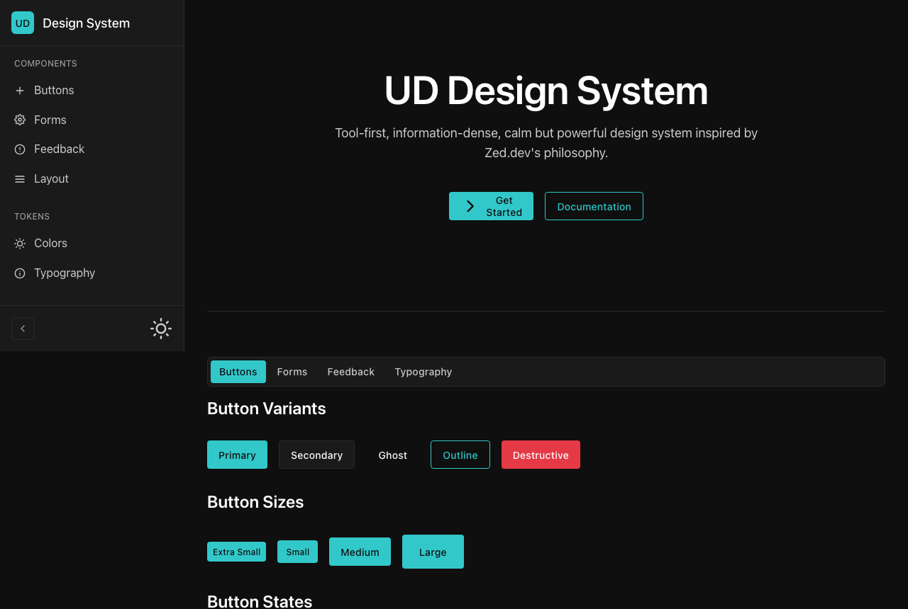
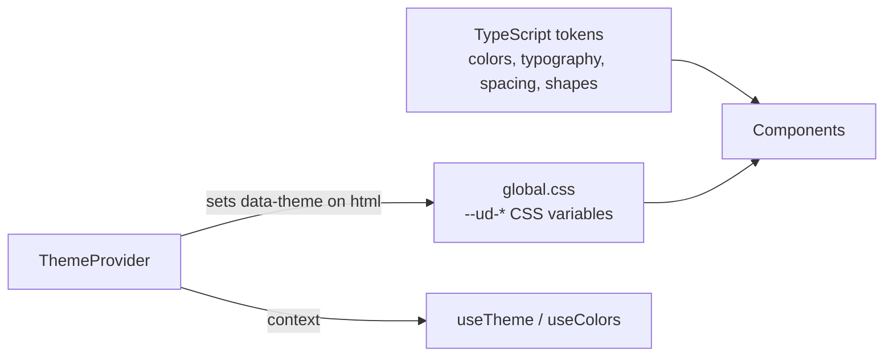

# UD Design System

A small React + TypeScript component library and token set for dense, dark-first tool interfaces, modeled on the look of the Zed editor's website.

[](#license)
[](package.json)



## Why

Many component libraries are built for marketing sites and consumer apps. This one is for tool-style UIs: mostly neutral grays, high contrast, a single teal accent for everything interactive, and compact spacing. The design notes behind it are in [`UD-Design-System-Analysis.md`](UD-Design-System-Analysis.md) (Turkish/English).

Design principles:

- Few colors: grays, one teal accent, and red/amber/green for status.
- High contrast: white text on near-black by default.
- One accent: every interactive element uses the same teal.
- Neutral styling rather than trend-driven effects.
- Whitespace is deliberate; density only where content needs it.

## Quick start

Requires Node.js and npm. The package is not published on npm, so work from a clone:

```bash
git clone https://github.com/mrsarac/ud-design-system
cd ud-design-system
npm install

npm run dev               # demo app (index.html -> src/demo)
npm run storybook         # Storybook on http://localhost:6006
npm run type-check        # tsc --noEmit
npm run build             # type-check, then library build into dist/
npm run build-storybook   # static Storybook into storybook-static/
```

`npm run build` writes `dist/index.es.js`, `dist/index.umd.js`, `dist/style.css` and type declarations.

## Usage

The examples show the public API exported from `src/index.ts`. See Status / limits before consuming the build as a package.

### Design tokens

```typescript
import { tokens } from '@mustafasarac/ud-design-system';

tokens.colors.semantic.dark.accent      // '#32C8CA'
tokens.typography.textStyles.h1         // { fontSize: '48px', fontWeight: 600, ... }
tokens.spacing.base[4]                  // '16px'
tokens.shapes.borderRadius.md           // '6px'
```

The individual token groups (`primitiveColors`, `semanticColors`, `spacing`, `textStyles`, `borderRadius`, ...) are exported too.

### Theming

```tsx
import { ThemeProvider, useTheme } from '@mustafasarac/ud-design-system';

function App() {
  return (
    <ThemeProvider defaultTheme="dark">
      <MyApp />
    </ThemeProvider>
  );
}

function ThemeToggle() {
  const { theme, toggleTheme } = useTheme();
  return <button onClick={toggleTheme}>{theme}</button>;
}
```

`useColors()` returns the current theme's semantic colors and falls back to dark outside a provider.

## Components

| Group | Components |
|---|---|
| Primitives | `Text`, `Surface`, `Divider`, `Icon`, `Stack` / `VStack` / `HStack` |
| Buttons | `Button` (primary, secondary, ghost, outline, destructive), `IconButton`, `ButtonGroup` |
| Forms | `Input` (label, helper, error), `Textarea`, `Select`, `Checkbox` (with indeterminate), `Toggle` |
| Feedback | `Badge`, `Toast` / `ToastContainer`, `Dialog`, `Tooltip` |
| Layout | `Tabs` (`TabsList`, `TabsTrigger`, `TabsContent`), `Sidebar` (collapsible), `Panel` (optionally resizable, collapsible) |

Icons come from `lucide-react`; class names are merged with `cn` (a `clsx` wrapper).

## How it works



- Tokens live in `src/tokens/` as typed constants and are exported both individually and as one `tokens` object.
- `src/styles/global.css` defines the same values as `--ud-*` CSS variables. Dark is the default on `:root`; `[data-theme="light"]` overrides them.
- Components style themselves with those CSS variables, so switching theme is a single attribute change.
- `ThemeProvider` keeps the current theme in React state, writes it to `document.documentElement`, and exposes it through `useTheme`.

## Color palette

| Token | Dark | Light |
|-------|------|-------|
| Background | `#0F0F0F` | `#FFFFFF` |
| Surface | `#1A1A1A` | `#F5F5F5` |
| Text | `#FFFFFF` | `#0F0F0F` |
| Accent | `#32C8CA` | `#2AB5B9` |
| Error | `#E63946` | `#D62828` |
| Success | `#52B788` | `#2D6A4F` |

## Status / limits

- Early (v1.0.0 in `package.json`, single initial commit, no tags or releases).
- Not published on npm. `package.json` points `main` / `module` at `dist/index.js` / `dist/index.esm.js`, but the build produces `dist/index.es.js` / `dist/index.umd.js`, so importing it as a package will not resolve until those fields are fixed. Consumers also need to import `dist/style.css`.
- No automated tests. Storybook stories exist for `Button`, `Badge` and `Input` only.
- `npm run lint` fails: there is no ESLint config in the repo.
- Keyboard support is basic: `Dialog` closes on Escape; `Tabs` has no arrow-key navigation.
- React 18 peer dependency; React 19 is untested.
- No hosted demo or Storybook; run them locally.

## Inspired by

- [Zed](https://zed.dev) website: tool-first presentation
- Bloomberg Terminal: information density
- Sublime Text: minimal chrome
- IBM Carbon: token-based structure

## License

MIT. See [LICENSE](LICENSE).
